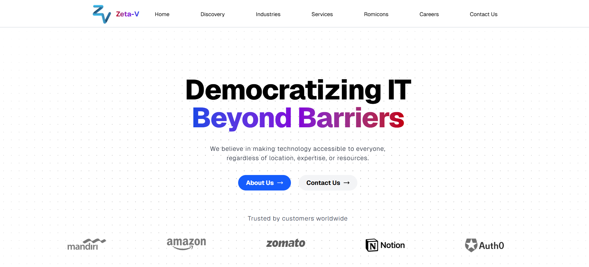

# Company Landing Page

A modern, responsive landing page for **Zeta-V**, built with [Next.js](https://nextjs.org/), [Tailwind CSS](https://tailwindcss.com/), and [shadcn/ui](https://ui.shadcn.com/).  
This project is designed to be fast, accessible, and easily customizable.

---

## 🚀 Features

- ⚡ **Blazing fast** performance with Next.js
- 📱 **Fully responsive** design
- 🎨 **Beautiful UI components** from shadcn/ui
- 🎯 **SEO-friendly** with optimized meta tags
- 🛠 **Easy customization** with Tailwind CSS utility classes

---

## 📸 Preview

---

## 🛠 Tech Stack

- **Framework:** [Next.js](https://nextjs.org/)
- **Styling:** [Tailwind CSS](https://tailwindcss.com/)
- **UI Components:** [shadcn/ui](https://ui.shadcn.com/)
- **Icons:** [lucide-react](https://lucide.dev/)

---
